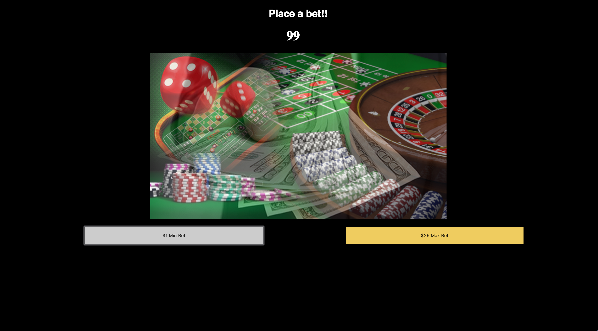

# 🎰 Week05 Bootcamp2019a Project: Slot Machine

Like to gamble without having to break the bank? just play my quick, super easy slot machine.

**Link to project:**

## How It's Made:

**Tech used:** HTML, CSS and JavaScript

I built this project by creating an HTML document in order to create the header, image tags and button elements for you to min-bet or max-bet. Then I created the JavaScript file that will target the elements in my HTML document and give each element a function. After I completed both the HTML and JavaScript I created a CSS file in order to style my site background color and positioning.

## Lessons Learned:

I was able to get a better understanding of conditionals.
